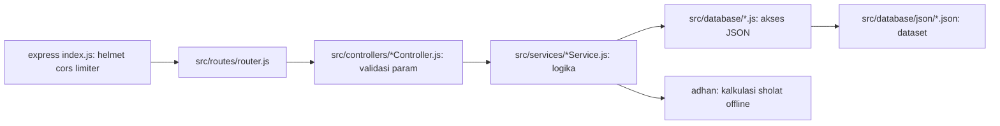

# Islamic API (`muslim-api/`)

- REST API Al-Qur'an Indonesia (Kemenag), doa, dzikir, hadits Arba'in,
  dan jadwal sholat offline
- Semua response JSON terstruktur (`data` + opsional `meta`), cache edge,
  rate limit 100 req/menit/IP
- Deployable ke Vercel serverless atau dijalankan langsung via `node`

## Structure of the Dir

| Dir | Description |
| :--- | :--- |
| `scripts/` | Script utilitas Python/Node: generate OpenAPI spec, smoke test |
| `src/` | Seluruh source aplikasi: routes, controllers, services, data |
| `node_modules/` | Dependency npm (tidak di-commit) |

## Description of Files

| File | Description | Cluster |
| :--- | :--- | :--- |
| `.gitignore` | Abaikan `node_modules/`, log, `.env`, `.vercel` | Config |
| `.run-3001.log` | Log runtime lokal; tidak di-commit | Config |
| `index.js` | Entry express: helmet, cors, limiter, error handler | Bootstrap |
| `package-lock.json` | Lockfile dependency npm | Config |
| `package.json` | Manifest npm: scripts, deps (`adhan`, `express`, dll) | Config |
| `README.md` | Dokumentasi publik: fitur, endpoint, cara pakai | Docs |
| `vercel.json` | Konfigurasi deploy Vercel: semua route ke `index.js` | Config |

## Description of Executables

- Tidak ada file executable; semua dijalankan lewat `npm` scripts atau `python3`

| Command | Description |
| :--- | :--- |
| `npm start` | Jalankan server produksi (`node index.js`), port dari `PORT` |
| `npm run dev` | Jalankan dengan `nodemon` (auto-restart saat file berubah) |
| `npm run build` | `npm install` untuk Vercel build step |
| `npm test` | Smoke test: boot server port 3210, asser 12+ perilaku |
| `npm run docs` | Regenerate `src/docs.json` dari definisi route Python |

## `scripts/gen-docs.py`

- Generate ulang `src/docs.json` (OpenAPI 3.0) agar docs Scalar tidak drift
- Definisi path ada di list `ROUTES`; output ditulis ke `src/docs.json`

- Regenerate spec:
  ```bash
  > npm run docs
  ```

## `scripts/test.js`

- Boot `index.js` di port 3210 via `child_process.fork`
- Assert perilaku: validasi param, paginasi, batas 404, header, endpoint sholat
- Exit code 1 jika ada yang gagal; aman untuk CI

- Jalankan smoke test:
  ```bash
  > npm test
  ```

## Description of Workflows

- Menjalankan secara lokal:
  ```bash
  > npm install
  > npm run dev
  ```

- Menambah endpoint baru:
  - Tambah handler di `src/controllers/`
  - Daftarkan route di `src/routes/router.js`
  - Tambah entri di `ROUTES` `scripts/gen-docs.py`, lalu `npm run docs`
  - Tambah case di `scripts/test.js`, lalu `npm test`

## Description of Architecture

- Alur request satu arah: `router -> controller -> service -> database`



- Layer per domain (quran, doa, dzikir, hadits, sholat):
  - `src/controllers/`: validasi parameter (`badRequest`, `notFound`, `paginate`)
  - `src/services/`: logika bisnis; `sholatService` pakai `adhan`
    (param Singapore, madhab Syafi'i) + `Intl.DateTimeFormat` per timezone
  - `src/database/`: pembaca data JSON; `kabkota.json` bundled 55 kota
- Cross-cutting di `src/utils/respond.js`:
  - `error`, `badRequest`, `notFound`, `sendData`, `parsePositiveInt`, `paginate`
- Caching dan docs:
  - Middleware cache di `router.js`: `s-maxage=86400, stale-while-revalidate`
  - `/docs.json` diserve dari `src/docs.json`; `/` memuat Scalar dari jsDelivr
